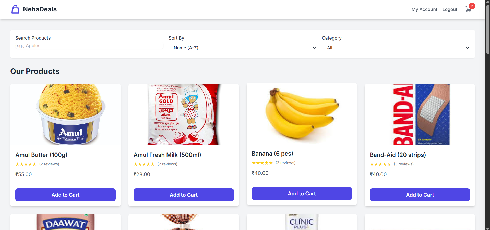

# 🛒 Local Store E-Commerce Platform

A **responsive, single-page front-end application** that simulates a local grocery and essentials e-commerce store.  
Built with **vanilla HTML, CSS (Tailwind CSS), and JavaScript**, featuring a **mock API** to simulate back-end functionality without requiring a live server or database.

  

---

## ✨ Features

- **Product Catalog**: Browse a grid of products with images, names, ratings, and prices.  
- **Search & Filter**:  
  - Live search for products by name.  
  - Filter by category.  
  - Sort by name, price (ascending/descending).  
- **Product Details Modal**: Click on a product to view detailed info, a larger image, and customer reviews.  
- **Shopping Cart**:  
  - Add/remove products.  
  - Increase/decrease item quantity.  
  - Real-time cart total and item count.  
- **Mock User Authentication**:  
  - Sign up with name, email, and password.  
  - Log in with existing credentials.  
  - Session persistence via `localStorage`.  
- **Customer Reviews**: Logged-in users can add product reviews and ratings.  
- **Mock Checkout**: Simulated checkout process creating orders for logged-in users.  
- **My Account Page**: View past order history (for logged-in users).  
- **Responsive Design**: Optimized for desktop, tablet, and mobile.  

---

## 🛠️ Technologies Used

- **HTML5** → Core structure and content.  
- **CSS3** → Custom styling and animations.  
- **Tailwind CSS** → Utility-first CSS framework for rapid UI.  
- **Vanilla JavaScript (ES6+)** → Application logic, DOM manipulation, interactivity.  
- **Mock API** → Simulated back-end (users, orders, reviews) stored in-memory.  

---

## ⚙️ Setup & Installation

This is a front-end only project — no server setup required.  

### ✅ Prerequisites
- A modern browser (Chrome, Firefox, Edge).  
- Code editor (VS Code recommended).  

### ▶️ Running the Application
Because this project uses JavaScript modules (`type="module"`), it must be run from a **local web server**. Opening `index.html` directly will cause CORS errors.  

Recommended: **Live Server extension in VS Code**  

1. **Clone or Download the Repository**
   ```bash
   git clone https://github.com/your-username/your-repo-name.git
   cd your-repo-name
   ```
   *(Or download ZIP and extract it.)*

2. **Ensure File Structure**
   ```
   your-project-folder/
   ├── assets/
   │   ├── Rice.jpg
   │   └── (all other product images...)
   ├── index.html
   ├── styles.css
   ├── main.js
   └── README.md
   ```

3. **Open with Live Server**
   - Install Live Server in VS Code.  
   - Right-click `index.html` → **Open with Live Server**.  

4. **View the App**
   - Browser will open at `http://127.0.0.1:5500` (or similar).  
   - 🎉 The application is running!  

---

## ⚡ How It Works

### Front-End
All logic is inside **`main.js`**:
- Rendering products in the DOM.  
- Managing cart & user state.  
- Handling user interactions and events.  
- Displaying/hiding modals & sidebars.  

### Simulated Back-End
A `mockApi` object in `main.js` mimics server behavior:
- Stores in-memory data (`mockDb`).  
- Provides async functions to simulate network requests:  
  - Sign up / Log in.  
  - Fetch orders.  
  - Add reviews.  

⚠️ **Note**: Data is **reset on page refresh** (since no real DB is used).  

---

